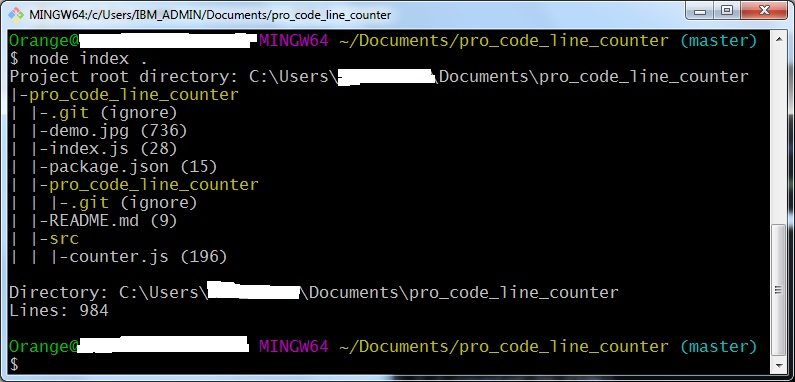

# pro_code_line_counter
A nodejs tool used to count how many lines code under a project folder

##How to use

1. Clone this repository `git clone https://github.com/Orange1991/pro_code_line_counter.git`
2. In the root directory of the cloned repository, use command `node index ./` to have a try, it will propably show you following result:

